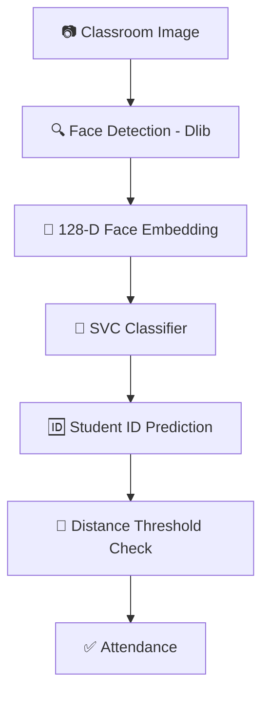
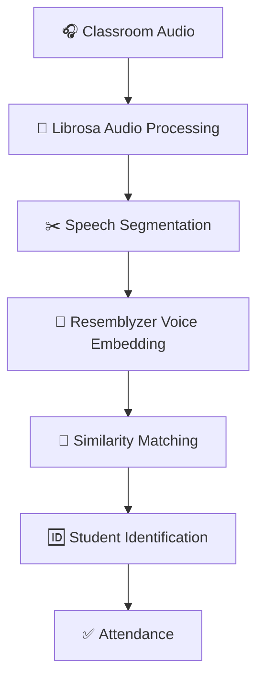
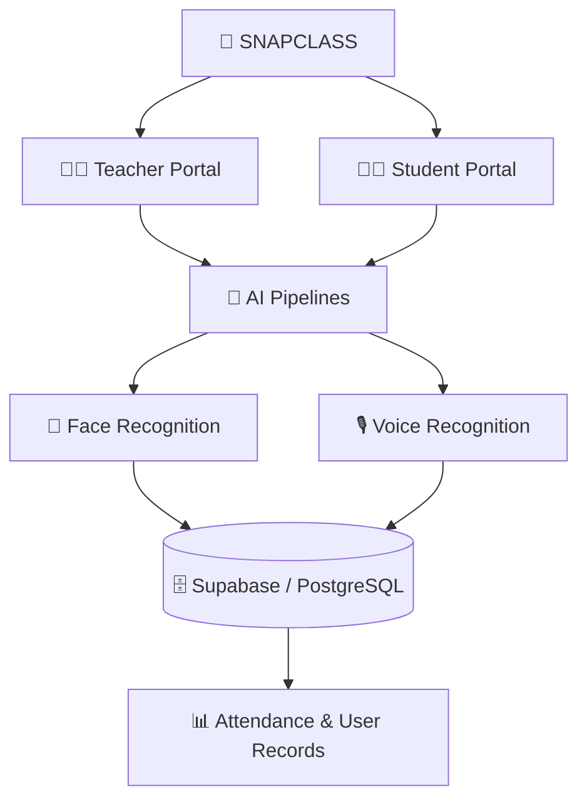

<div align="center">

# 📸 SNAPCLASS

### ✨ AI-Powered Attendance System ✨

<p>
  <b>Automated classroom attendance using Face Recognition + Voice Recognition.</b>
</p>

<p>
  <a href="https://snapclass-main-2ldavrzrff4rtafhtz3xii.streamlit.app/">
    
  </a>
  <a href="https://sc-landing-page-1uen.vercel.app/">
    
  </a>
  <a href="https://github.com/Aayesha2103/snapclass-main">
    
  </a>
</p>

<p>
  
  
  
  
  
</p>

</div>

---

## ✨ What is SnapClass?

**SnapClass** is an AI-powered classroom attendance system that automates attendance through **facial recognition** and **voice recognition**.

It provides separate **Teacher** and **Student** portals for managing subjects, student enrollment, biometric profiles, attendance, and attendance records.

### 🎯 Core Features

| 👨‍🏫 Teacher | 👨‍🎓 Student |
|---|---|
| 🔐 Register & Login | 📸 Face ID Login |
| 📚 Create & Manage Subjects | 🆕 New Profile Registration |
| 📸 Face Attendance | 🎙️ Optional Voice Enrollment |
| 🎙️ Voice Attendance | 🔗 Subject Code Enrollment |
| 🔳 Share Subject QR | 📊 View Enrolled Subjects |
| 📊 Attendance Records | 📈 View Attendance Stats |

---

## 🧠 AI Pipeline

### 📸 Face Recognition



### 🎙️ Voice Recognition



---

## 🛠️ Tech Stack

<div align="center">

| Layer | Technologies |
|---|---|
| 🐍 **Language** | Python |
| 🖥️ **UI / App** | Streamlit |
| 🌐 **Landing Page** | Flask + Jinja + HTML/CSS |
| 📸 **Face AI** | Dlib + face_recognition_models |
| 🤖 **ML Classifier** | scikit-learn SVC |
| 🎙️ **Voice AI** | Resemblyzer + Librosa |
| 🧮 **Data Processing** | NumPy + Pandas + Pillow |
| 🗄️ **Database** | Supabase + PostgreSQL |
| 🔐 **Security** | bcrypt |
| 🔳 **QR Generation** | Segno |
| ☁️ **Deployment** | Streamlit Cloud + Vercel |
| 🔧 **Version Control** | Git + GitHub |

</div>

---

## 🏗️ Architecture



The public landing page is built separately with **Flask** and deployed on **Vercel**, while the AI application runs on **Streamlit Cloud**.

---

## 🗄️ Database

Main PostgreSQL tables:

```text
teachers
students
subjects
student_subjects
attendance_logs
```

Relationship:

```text
teachers
   │
   └── subjects
          │
          └── student_subjects ── students

attendance_logs
   ├── student_id
   └── subject_id
```

---

## 🔐 Security

- 🔒 Teacher passwords are hashed using **bcrypt**.
- 🗝️ Supabase credentials are stored using **Streamlit Secrets**.
- 🧬 Biometric profiles are represented as stored **face and voice embeddings**.

---

## 🌐 Deployment

| Part | Platform |
|---|---|
| 🤖 AI Attendance App | Streamlit Cloud |
| 🌐 Landing Page | Vercel |
| 🗄️ Database | Supabase |

---

## 💡 Why SnapClass?

<div align="center">

| ❌ Manual Attendance | ✅ SnapClass |
|:-:|:-:|
| 🐢 Slow | 📸 Face AI |
| 🔁 Repetitive | 🎙️ Voice AI |
| 😵 Difficult to manage | 🔳 QR Enrollment |
| | 📊 Digital Records |

</div>

---

## 📌 Project Status

> 🚧 **Working Prototype / Active Development**

The current system is focused on the core attendance workflow, biometric identification, subject enrollment, dashboards, and cloud deployment.

---

<div align="center">

### 👩‍💻 Built by **Aayesha Singh**

<p>
  <a href="https://github.com/Aayesha2103">GitHub Profile</a>
  ·
  <a href="https://snapclass-main-2ldavrzrff4rtafhtz3xii.streamlit.app/">Try SnapClass</a>
  ·
  <a href="https://sc-landing-page-1uen.vercel.app/">Landing Page</a>
</p>

</div>
